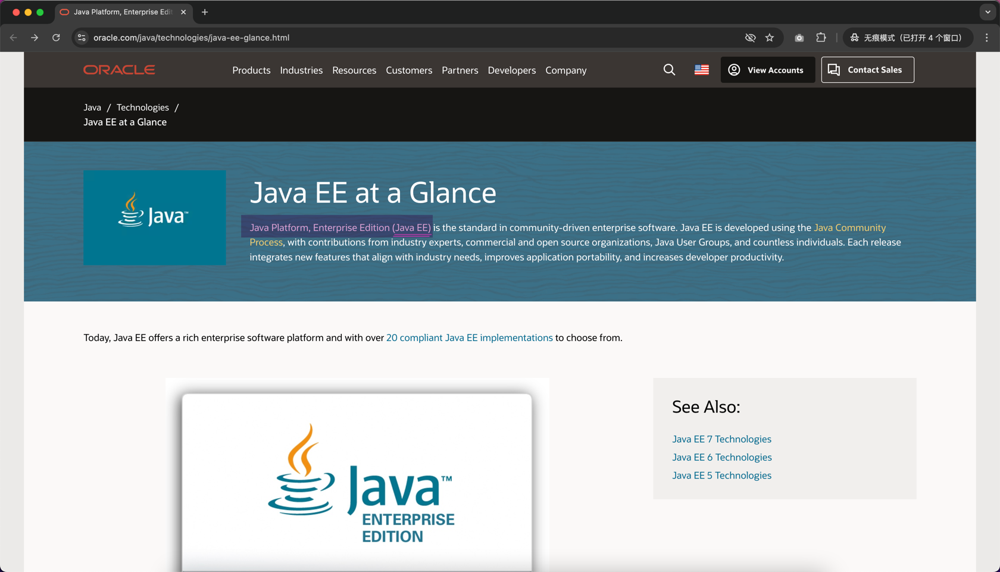

## 再次复习 `J2EE`、`Java EE` 、`Jakarta EE`
- 它们指的都是同一个东西，只是不同的时间，不同的叫法差异而已
- 

- Java SE: Java Platform, Standard Edition
    - 
- Java EE: Java Platform, Enterprise Edition
    - 
- Jakarta EE: is the evolution of the Java EE platform
    - 
- 之前看 `Tomcat` 官网的时候也见过这几个字眼
    - 

## 创建`新类型`项目：`Jakarta EE`
- 
- 
- 创建完成之后的代码结构
    - 

## EE 项目的总体流程
- `写代码` -> `打包`  -> `部署` -> `验证`
1. 写代码（暂时是 IDEA 自动生成的）
2. 打包
3. 部署
4. 验证
- 

## `修改代码`，需要重新执行 -> `打包`  -> `部署` -> `验证`
- 

## 麻烦？自动化：让 IDEA 帮我们自动完成琐碎的操作
- 
- 
- 
- 
- 
- 
- 如果遇到 8080 端口被占用的错误
    - 
    - 或者按以下顺序检查及配置
        1. 检查之前的 MyServer 程序是否已经停止了（因为当前我们用的就是跟 Tomcat 一样的 8080 端口）
        2. 检查是否之前已经启动过 Tomcat，如果是，Windows 执行 shutdown.bat 脚本命令；macOS 或者 Linux 执行 shutdown.sh 停止服务
        3. 或者修改 Tomcat 的默认端口
        - 

## `静态资源` vs `动态资源`
下图所示的是创建项目自动生成的 Servlet 代码，之后我们回自己写 Servlet 进一步体会
- 

## 自己写的第一个 `Servlet`
- 
- 
- 验证1：先在控制台打印日志
    - 
- 验证2：多次请求，会多次执行，即：多次打印日志
    - 
- 验证3：直接返回 html 格式的内容给客户端（如：浏览器）
    - 
    - 

## 今天核心知识小结
- 

## 课后作业
- 