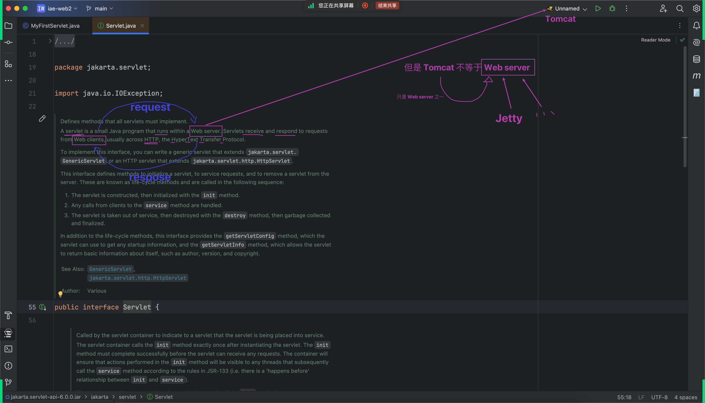
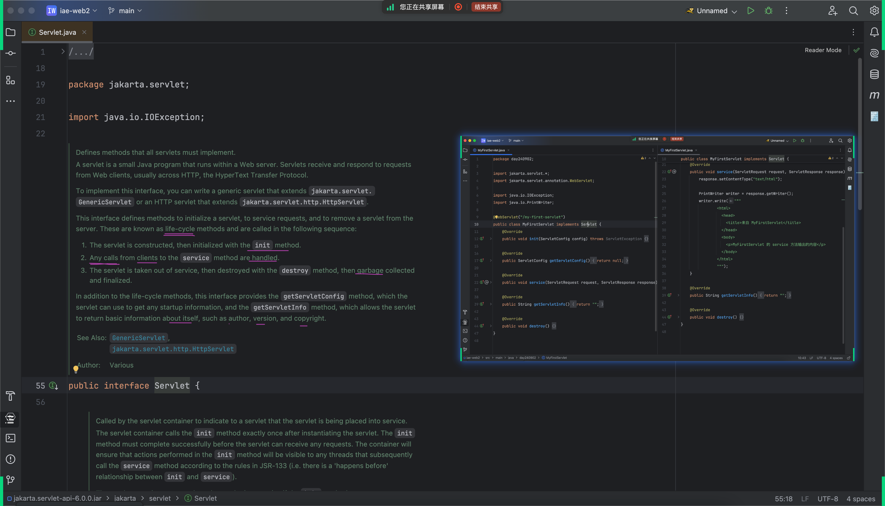
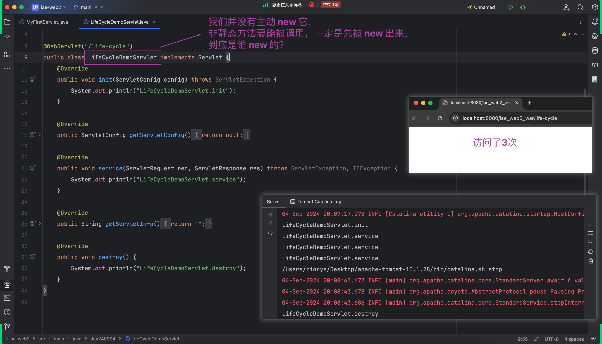
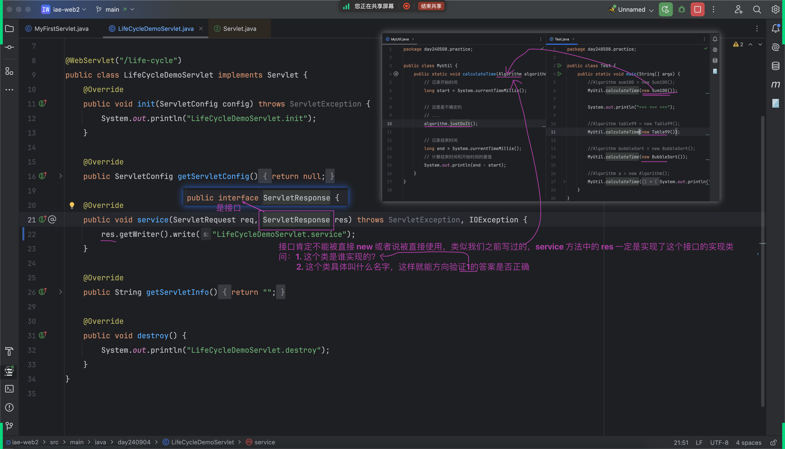
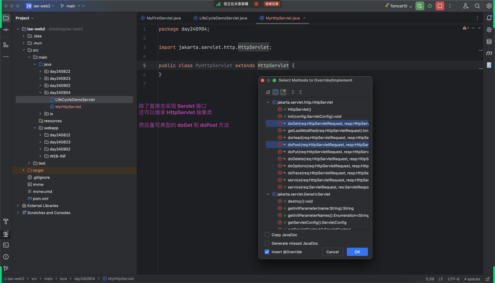
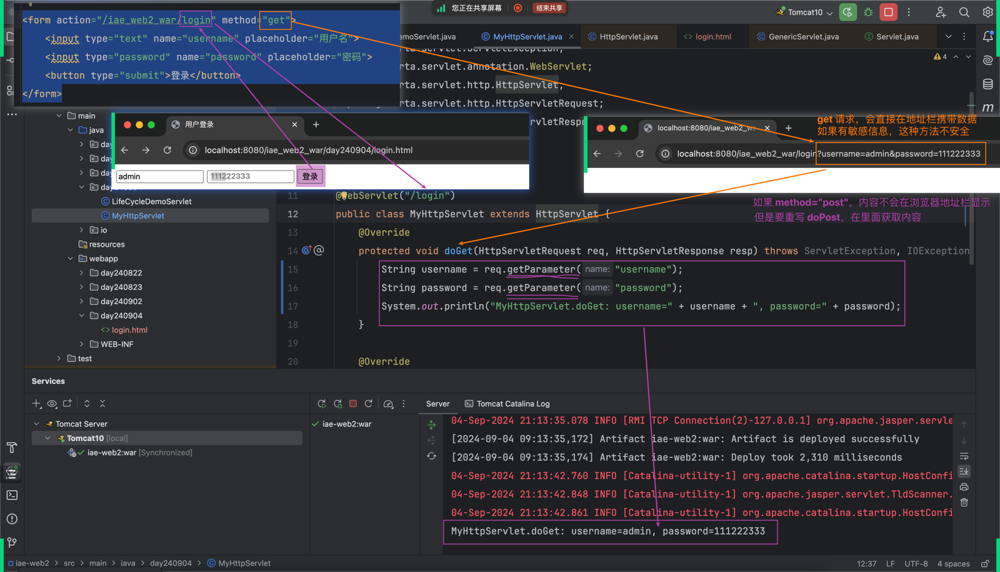
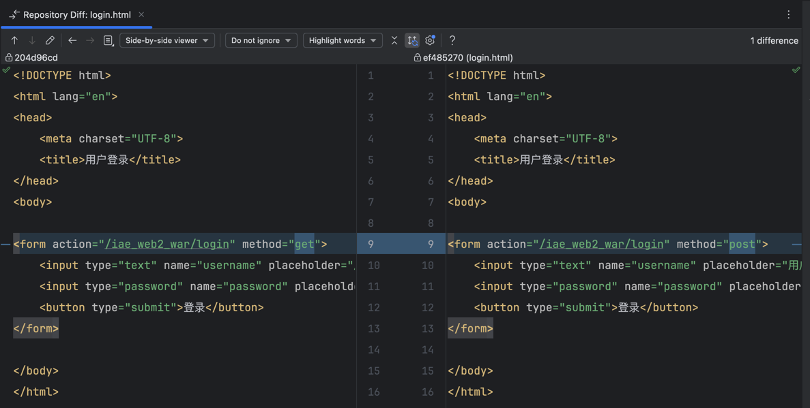
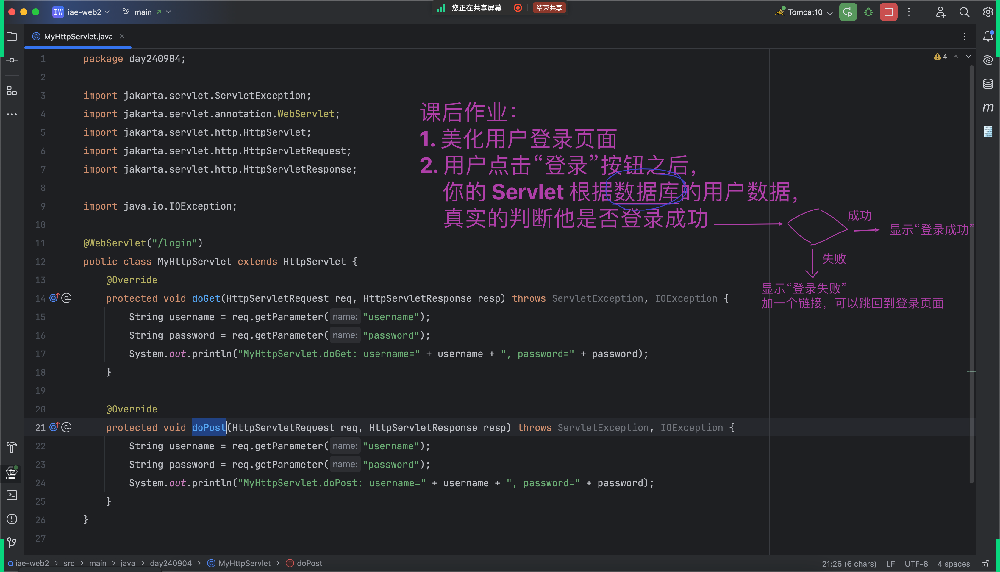

## 什么是 Servlet
- 上次课创建项目的时候自动生成过一个 Servlet，同时也自己快速写过一个 Servlet，但是还没细讲
- 今天从这个问题开始...

### 目的：别忘了之前一直强调的`找一手资源`
- 除了官网，还可以直接看源代码注释

### 注释中的解答
- 
- 

## Servlet 生命周期：life-cycle
- 

## 思考：到底是谁 new 了我们写的 Servlet
- 

## 思考：Servlet@service 方法中的 ServletResponse 到底是谁实现的？
- 通过看源码可以发现：ServletResponse 是一个接口，根据以前的只是，传进来的一定是具体的实现类
- 同理：ServletRequest 也一样
- 

## 除了直接实现 Servlet 接口，还可以继承 HttpServlet 抽象类
- 

## HTTP 协议中典型的方法之一：GET
- 

## HTTP 协议中典型的方法之一：POST
- 
- 

## 今天的核心
- 

## 作业
- 