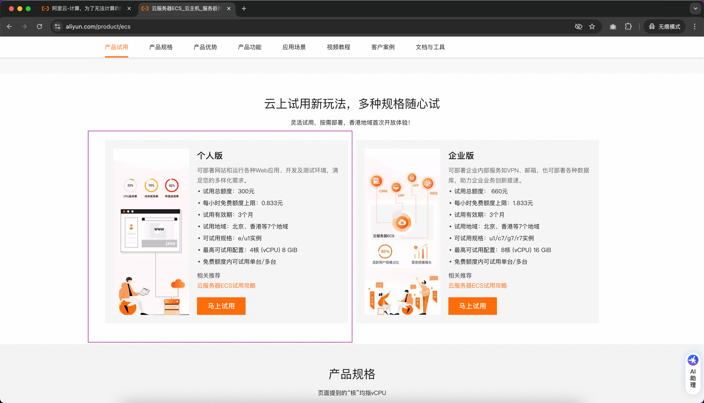
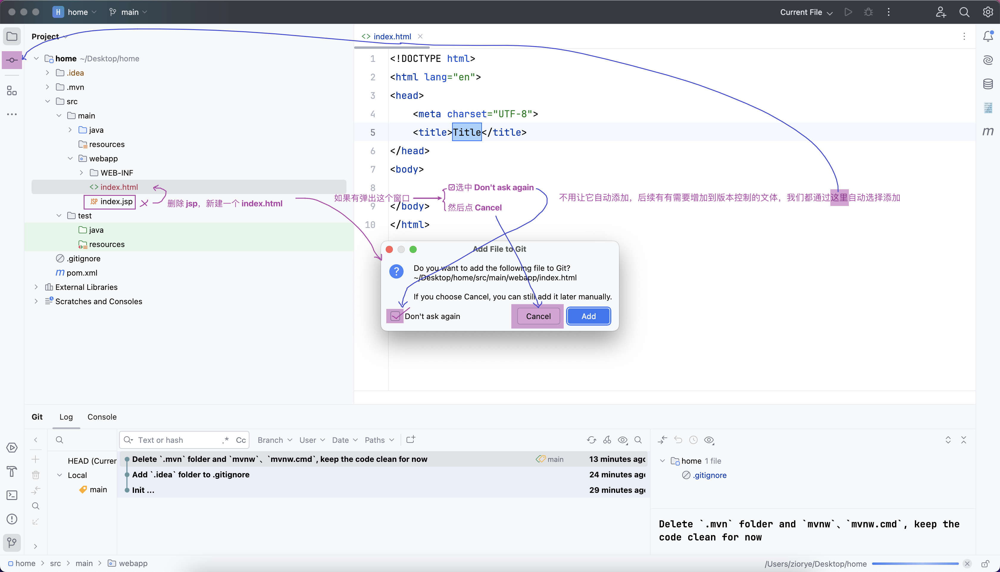

## 购买服务器
正好有同学刚刚开通好阿里云账号，借机完整复习一遍购买服务器的流程：
- 新账号可以免费试用三个月的阿里云 ECS 服务器
  - 
- 下单：选附近的区域、配置、操作系统统一先选择 Ubuntu22.04、等...
  - 
## 进入控制台，完成一些必要操作
- 把公网IP保存起来，后续会无数次使用
  - 
- 创建密钥对（替代传统手动输入密码的登录方式）
  - 
  - 自动下载 ecs-key.pem 
  - 把这个密钥对跟我们的这台服务器绑定起来
    - 
    - 重启 
    - 查看是否重启成功 
## 连上服务器，尽情玩弄它吧
有了 `密钥对` + `服务器公网IP` 就可以在本地连上服务器，并控制它了
- 

## 常用 Linux 命令
暂时不用刻意学，今天需要什么命令就介绍什么命令，后续如果感兴趣，可以自学
- `pwd` 打印当前工作目录
- `whoami` 打印当前登录用户
- `man` 
  - 如：`man pwd` 遇到不懂的命令，就问这个男人
  - 按 `空格` 翻页
  - 按 `q` 退出
- `clear` 清除屏幕
- `cd`
- `cd ..` 返回上一个目录
- `ll`
- `ls`

## 安装 Java
- `java -version`
- `apt install default-jdk`
- `apt update`
- 按向上箭头 => 调出上一次执行过的命令 => 再按一次向上箭头
- `apt install default-jdk`
  - 
- 再命令行黑窗口中按住：`ctrl +` 放大
- `java -version` //验证是否安装完成
- `javac -version` //验证是否安装完成

## 安装 Tomcat
### 下载
#### 方式一：`wget` 直接下载到远程服务器
- 在服务器的命令行中执行 `wget https://dlcdn.apache.org/tomcat/tomcat-10/v10.1.28/bin/apache-tomcat-10.1.28.zip`
  - 
  - 下载 apache-tomcat-10.1.28.zip
#### 方式二：`scp` 把本地的压缩包上传到远程服务器的指定路径下
- 在本地下载 https://dlcdn.apache.org/tomcat/tomcat-10/v10.1.28/bin/apache-tomcat-10.1.28.zip
- `scp -i ecs-key.pem apache-tomcat-10.1.28.zip root@你的公网IP地址:/root`
  - 

### 解压
- `unzip apache-tomcat-10.1.28.zip`
- 根据提示，先安装 unzip： `apt install unzip`
  - 
- 再执行一次 `unzip apache-tomcat-10.1.28.zip`
- `cd apache-tomcat-10.1.28`
- `ll`
- `cd bin`
- `ll`
- `chmod +x catalina.sh`
  - 

## 启动 Tomcat
- `./catalina.sh start`

## 停止 Tomcat
- `./catalina.sh stop`

## 开放 8080 端口。回到阿里云控制台进行操作
- 即：允许外部机器访问服务器上的 8080 端口，也就是我们的 Tomcat 服务器
- `安全组` -> `管理规则`
  - 
- `手动添加访问规则`
  - 

## 验证是否可以访问 Tomcat
- 浏览器访问 `你的公网IP地址:8080`
- 

## 把 Tomcat 默认页面替换成自己写的简单 html
- `cd /root/apache-tomcat-10.1.28/webapps`
- `mv ROOT ROOT_bak` 可以理解成重命名
- `mkdir ROOT` 创建 ROOT 文件夹
- 然后在本地创建一个 html 页面（这个步骤可以不做，后面会创建新项目）
- 通过 scp 上传到远程（这个步骤可以不做，后面有更方便的上传方式）
- 浏览器重新访问 `你的公网IP地址:8080`

## 创建新的 Jakarta EE 项目
- 
- 
- 
- 
- 
- 
- 
- 
- 
- 
- 
- 

## 配置 IDEA 编辑器集成的 SSH 工具
- 
- 

## 配置 IDEA 编辑器集成的 SFTP 工具
- 方便浏览远程文件 Browse Remote Host
- 方便把本地的项目部署到远程 Deployment
- 
- 
- 
- 

## 把端口 `8080` 改成 `80`，浏览器地址栏可以省略端口
- 默认 Tomcat 服务器使用的是 8080 端口
- 把它改成 80 端口
  - `cd /root/apache-tomcat-10.1.28/conf`
  - `vim server.xml` 用 vim 命令打开 server.xml 配置文件
  - `h`、`j`、`k`、`l` 移动光标
  - `i` 进入`插入模式 `
  - 把下图所示的 8080 改成 80
    - 
  - 按 `esc` 退出`插入模式 `
  - 按 `:wq` 保存修改并退出 vim
- 重启 Tomcat
  - `cd /root/apache-tomcat-10.1.28/bin`
  - `./catalina.sh stop` 先停止
  - `./catalina.sh start` 再启动
  - 或者输入完整路径，这样在任何路径下都可以操作 catalina.sh
    - `/root/apache-tomcat-10.1.28/bin/catalina.sh stop`
    - `/root/apache-tomcat-10.1.28/bin/catalina.sh start`
### 验证是否生效
- 浏览器访问 `你的公网IP地址`
- 这次不需要带端口了，因为 80 是默认可以省略不写的

## 域名
- 申请一个自己的域名
- 让这个域名跟这台服务器或者说跟这台服务器的公网IP关联起来
  - 
  - 
  - 
- 这样，就可以直接在浏览器访问域名了，不用再记IP了
  - 

## 关于备案
- 锅内特色：锅内的域名、绑定锅内的服务器，需要备案
- 上一步绑定成功之后，前面几次访问没问题
- 后续如果它自动检测到域名没备案，会弹出下图所示的备案要求
  - 
- 备注：备案时对你购买的服务器有一些要求，其中重要的一点如下图所示：
  