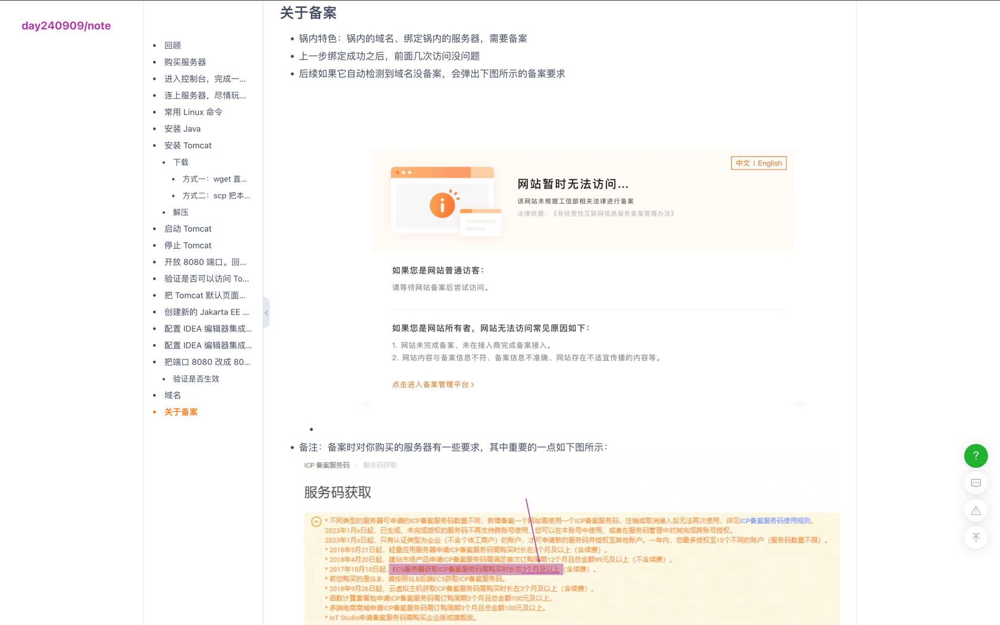
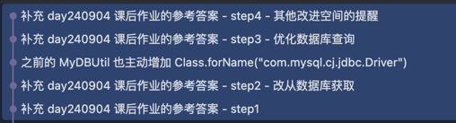
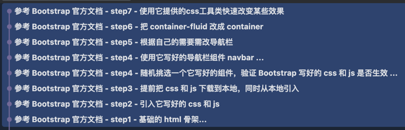
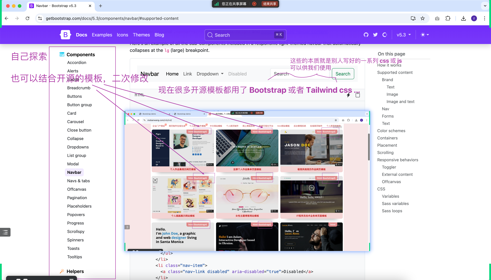
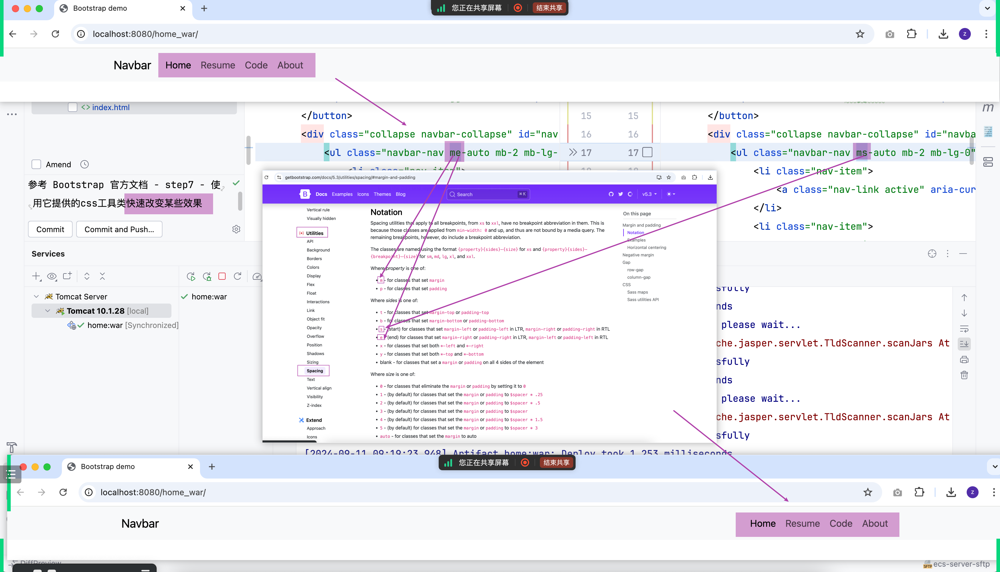
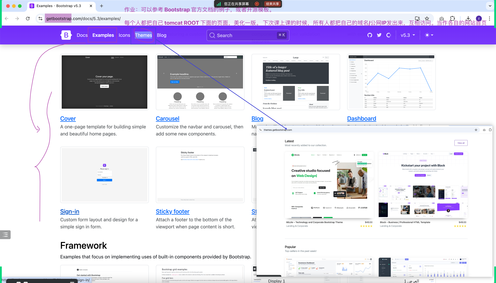

## 关于`域名`和`备案`
- 
- 本质原因：这是我们锅内的“特色”
- 从技术上来说，完全不需要这个环节。有了域名，有了服务器，两者关联上即可
- 解决方法：
  - 去锅外的平台买服务器和域名
  - 买一台符合要求的服务器（要花钱的，不强制要求，自己决定）
  - 不买域名也行，直接用公网IP地址访问

## 上上次课后作业参考答案
见 iae-web2 的 commit 记录
- 在 Servlet 中访问数据库
- `Class.forName("com.mysql.cj.jdbc.Driver");`
- 

## 介绍 `Bootstrap` 和 `Tailwind CSS`
一些别人写好的 CSS 代码、框架
- https://getbootstrap.com/
- https://tailwindcss.com/
- 
- 
- 
- 界面相关的，属于前端领域的知识，我们会，是加分项。不会也行，进大公司都会有专门的前端开发工程师来做
- 自己感兴趣也值得学，就是需要时间慢慢探索，可以先从模仿开始
- 如果实在不感兴趣，也没事。前提是要把 Java 后端知识学好来。后续做项目有涉及到页面的，会给大家提供好前端代码
- 建议大家也都学一些前端知识

## 课后作业
- 