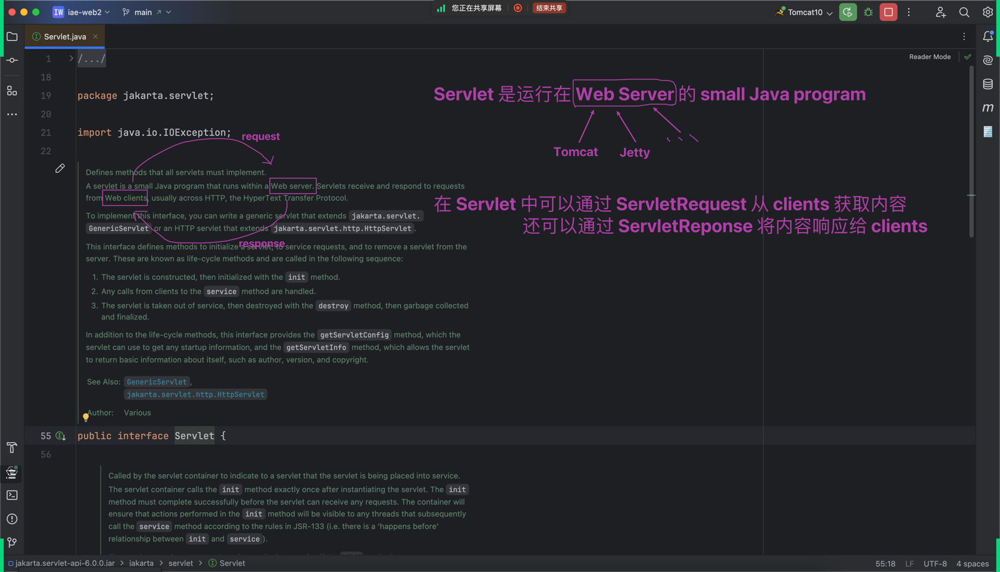
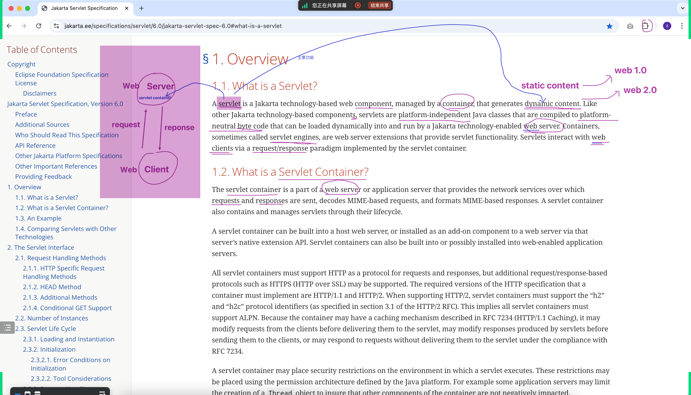
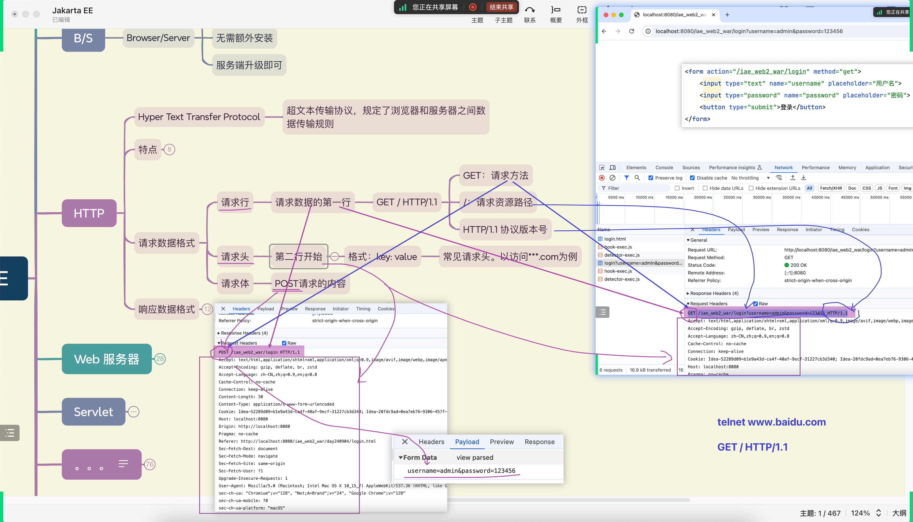
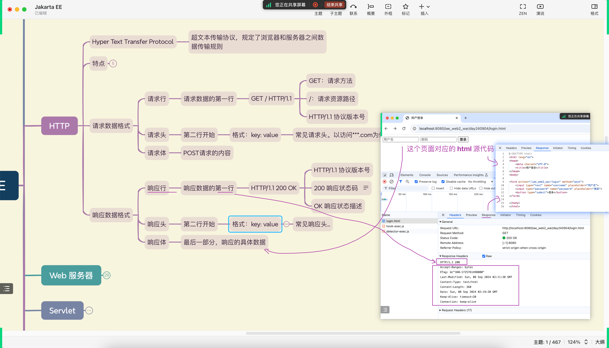
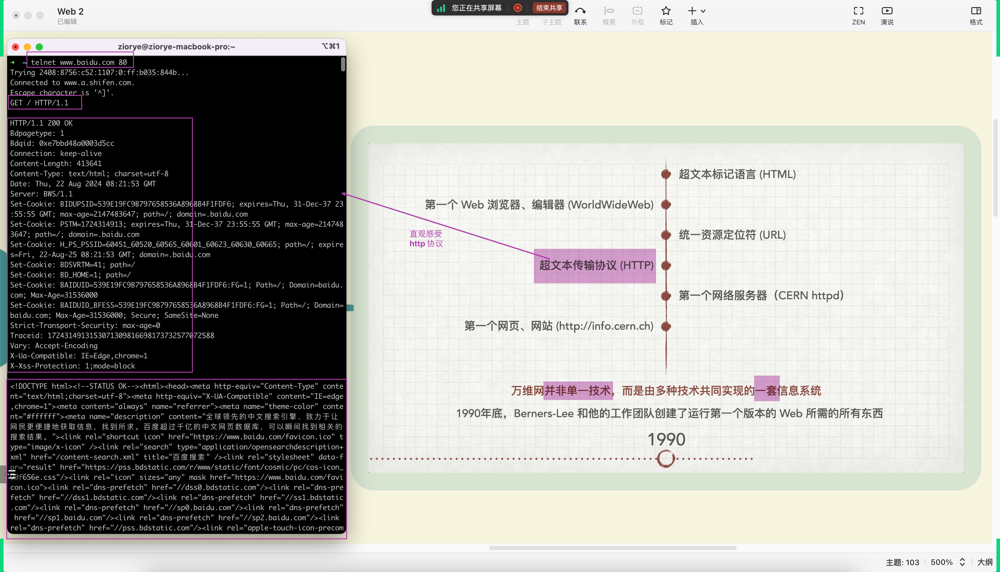
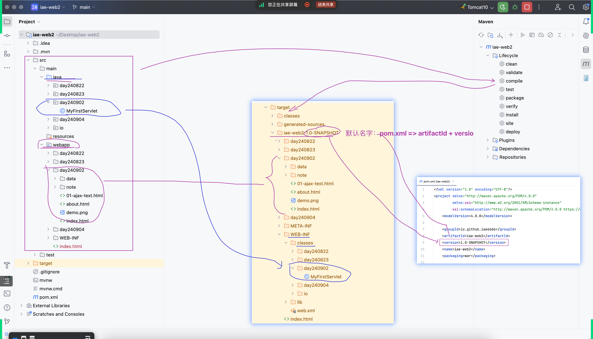
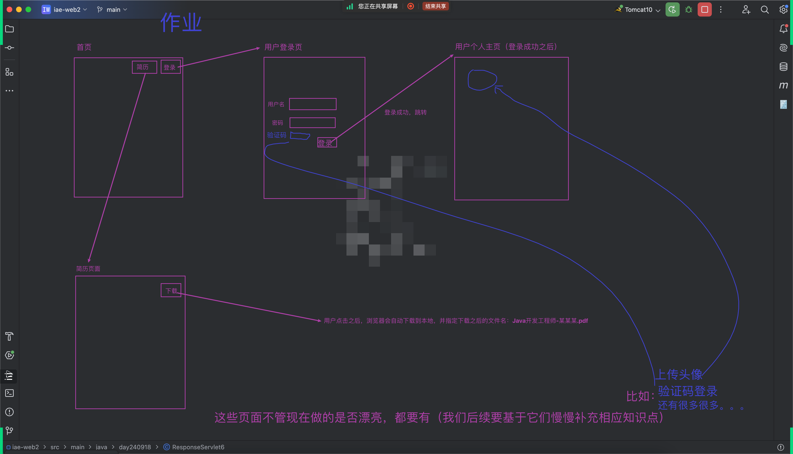

## Request 示例代码
### RequestServlet1
```shell
GET http://localhost:8080/web2_war/RequestServlet1
```
- 输出：你好，null

### RequestServlet1 with name parameter
```shell
GET http://localhost:8080/web2_war/RequestServlet1?name=傻逼
```
- 输出：你好，傻逼

---

### RequestServlet2 - show request and response
```shell
GET http://localhost:8080/web2_war/RequestServlet2
```
- 直接打印出 request 和 response 到底是由谁实现的

---

### RequestServlet3 - request.getXXX()
```shell
GET http://localhost:8080/web2_war/RequestServlet3
```
- 输出：getMethod、getContextPath、getRequestURL、getRequestURI、getQueryString、getHeader("user-agent") 的具体值
- 提醒：可以用这句获取跟操作系统无关的换行符 System.lineSeparator()

---

### RequestServlet4 - doGet
```shell
GET http://localhost:8080/web2_war/RequestServlet4?username=用户名_GET&password=secret
```
- 在控制台输出用户传递过来的 username 和 password 的值

### RequestServlet4_1 - doGet - 另一个 url
```shell
GET http://localhost:8080/web2_war/RequestServlet4_1?username=用户名_GET&password=secret
```
- 跟上一个效果一样，但是可以用另一个 url 访问同一个 Servlet
- 在控制台输出用户传递过来的 username 和 password 的值

### RequestServlet4 - doPost
```shell
POST http://localhost:8080/web2_war/RequestServlet4
Content-Type: application/x-www-form-urlencoded

username=用户名_POST&password=secret
```
- 这里演示的是如何在这个文件，模拟发送 POST 请求

---

### RequestServlet5 - request.getRequestDispatcher("/other-servlet").forward(request, response)
- 查看控制台的输出
```shell
GET http://localhost:8080/web2_war/RequestServlet5
```
- 功能：访问 RequestServlet5，实际上，RequestServlet5 的内部，调用了 RequestServlet6
- 同时在 RequestServlet5 中可以额外传递数据给 RequestServlet6（request.setAttribute("key", "value")）
- RequestServlet6 可以通过 request.getAttribute("key") 获取

### RequestServlet6 - 直接访问 vs 从 RequestServlet5 间接访问
```shell
GET http://localhost:8080/web2_war/RequestServlet6
```
- 查看控制台的输出，此时在 RequestServlet6 中 request.getAttribute("attr1") 返回为 null

## Response 示例代码
### ResponseServlet1 - 跳转 - setStatus(...) + setHeader("Location", "...")
```shell
GET http://localhost:8080/web2_war/ResponseServlet1
```
- 观察跟之前讲的「转发」的差异 - request.getRequestDispatcher("...").forward(request, response)

### ResponseServlet2 - 复习 response.getWriter().write(...)
```shell
GET http://localhost:8080/web2_war/ResponseServlet2
```

### ResponseServlet3 - write img
```shell
GET http://localhost:8080/web2_war/ResponseServlet3
```
- 除了往客户端写文本，也可以直接写图片等

### ResponseServlet4 - write img - IOUtils
```shell
GET http://localhost:8080/web2_war/ResponseServlet4
```
- 引入第三方库，更方便完成 IO 相关操作 `commons-io`

### ResponseServlet5 - write img - Content-Disposition:attachment
```shell
GET http://localhost:8080/web2_war/ResponseServlet5
```
- 服务端：设置符合协议的特定请求头；客户端：按照协议解析特定的请求头，并做相应处理

### ResponseServlet6 - write img - Content-Disposition:attachment;filename=custom-name.png
```shell
GET http://localhost:8080/web2_war/ResponseServlet6
```
- 在前一个功能的基础上，让客户端按照指定的名称下载

### ResponseServlet7 - redirect - Cache-Control: no-cache
```shell
GET http://localhost:8080/web2_war/ResponseServlet7
```
- 这个 Servlet 暂时可以先忽略，后续遇到再来回顾
- 如果后续遇到修改了跳转链接，发现短期内没生效，可能是客户端缓存了之前的地址
- 可以设置请求头 Cache-Control: no-cache 明确告诉客户端不要缓存

## 补充：复习之前画过的几张图
### `Web`
- 
### `Servlet` 及相关名词
- `Servlet`、`Servlet Container`、`Web Server`、`Web Client`
- 
- 
### HTTP 协议之 request
- 
### HTTP 协议之 response
- 
### 直观感受 HTTP 协议
- 
### Jakarta EE 项目的 `src` 和 `target` 的对应关系
- 

## HW
- 