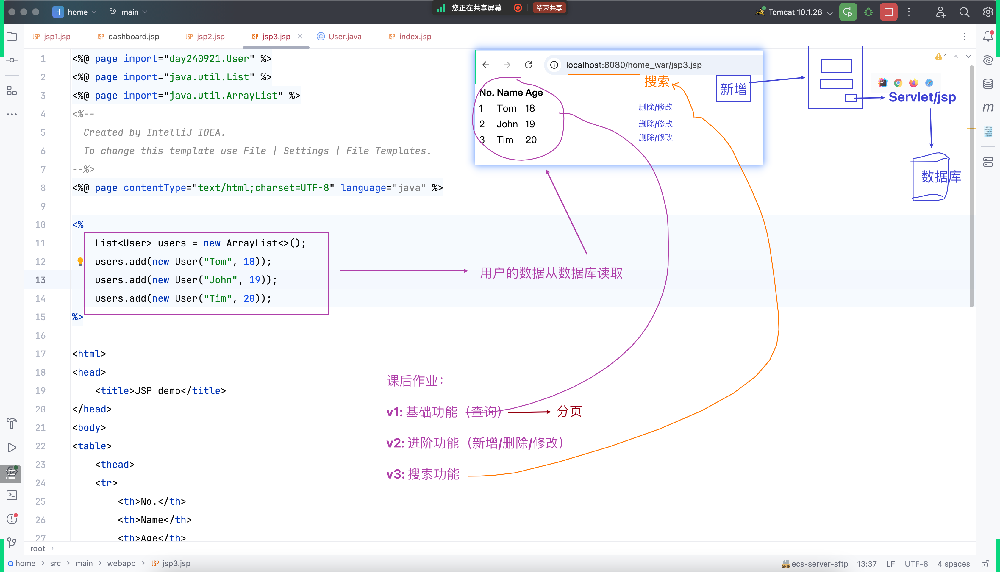

## todo-1: 如何在个人主页显示登录成功之后的邮箱地址？
- 

## todo-1: 解法之一 - 需要动态内容 - dynamic content - 可以交给 Servlet ...
- 直接跳转到 html 页面，改成跳转到 Servlet
- 注意：JDK 15 及以上才支持文本块
- 

## todo-1: 解法之一 - 传参 + 取参
- 

## todo-2: email 直接附带在浏览器地址栏，不安全。如何改进？回顾之前学过知识

## todo-2: 解法之一或者说是todo-1的解法二...
- request.getRequestDispatcher("...").forward(req, resp);
- 

## 观察地址栏差异
- 

## todo-3: 把 maven.compiler.target 改回 11 (error) - 兼容旧版本的写法
- 

## 把 maven.compiler.target 改回 17
- 

## 新建 welcome.html
- 

## todo-4: 新建 WelcomeServlet 并通过 ***.write(...) 的方式输出 welcome.html 的内容 ...
- 不要用 """ ... """ 文本块的新语法
- 要感受「麻烦」
- 我们会觉得麻烦，其他人也一样
- 进一步如何「解决麻烦」
- 

## todo-4: 完善 WelcomeServlet 代码
- 

## jsp: welcome.jsp - 探索 jsp 的本质 ...
- jsp 的本质是 Servlet
- ***.jsp 会被自动翻译成 Java 代码 ***_jsp.java
- 

## 在 jsp 中方便的插入 Java 代码
- 

## 增加几个 jsp 例子代码。理解它的本质，学会直接看自动生成的 ***_jsp.java 代码
- 

## 服务器：更新 JDK 版本、安装 MySQL 服务器
- 

## 课后作业：增删改查练习
- 

## Homework
### HW: 按照作业要求，修改主页
- 
### HW: 增加简历页面（轮廓）
- 
### HW: 简历页面 - 增加简历下载链接 - 先直接链接到之前写好的 Servlet
- 
### HW: 简历页面 - 增加真正处理简历下载的 Servlet (轮廓)

### HW: 简历页面 - 简历下载 - 改成下载 PDF 文件
- 
### HW: 简历页面 - 简历下载 - 解决中文文件名的问题 ...
- 看控制台报错信息
- 外部官方资源 https://developer.mozilla.org/zh-CN/docs/Web/HTTP/Headers/Content-Disposition
- 
### StandardCharsets.UTF_8
- 
### HW: 按照作业要求 - 增加登录页面 (轮廓)
- 
### HW: 按照作业要求 - 完善登录页面 - 先直接用别人写好的 ...
- https://getbootstrap.com/docs/5.3/forms/overview/
- 
### HW: 登录页面 - form 增加 method 和 action 属性，同时增加 LoginServlet (null)
- 
### HW: 登录页面 - input 增加 name 属性
- 
### HW: 登录页面 - input 增加 required 属性
- 
### HW: 登录页面 - 参考之前的代码完善登录逻辑 ...
- 新建数据库、用户表
- 插入基础数据
- MyDBUtil + mysql 依赖
- 
### 调用 request 的 getContextPath() 方法获取 context 路径
- 
### HW: 增加登录成功之后的个人主页 - Dashboard
- 
### HW: response.sendRedirect(...)
- 

