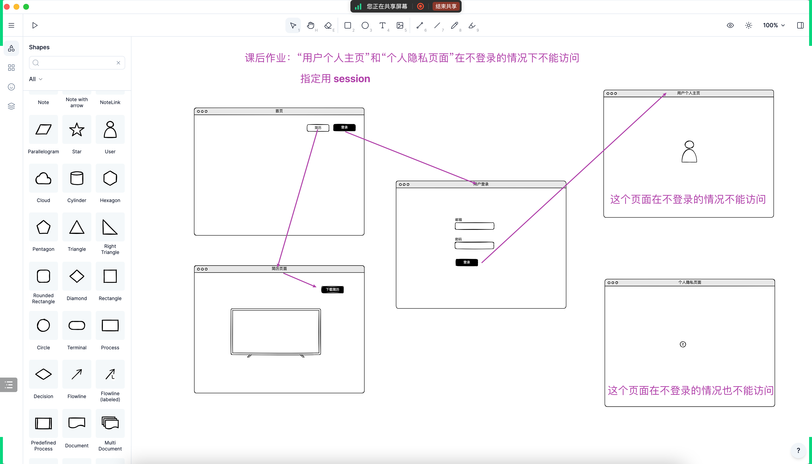

## 技术演进（Java 领域 - Web2.0 - Dynamic content）
- 
- 关键词：简化、优化（功能/性能上的提升）
- 

## EL (Expression Language)
- Servlet + JSP 分工合作：Servlet(负责业务处理、提供数据) + JSP(专注于页面展示)
- 

## JSTL (JavaServer Pages Standard Tag Library)
- 本质：进一步简化 JSP 写法
  - 减少 JSP 文件内嵌的 Java 代码
  - 使 Java 代码与 HTML 分离
  - 可以让代码慢慢往后续要介绍的 MVC 设计模式靠拢：Model、View、Controller 三者分工协作、各司其职
- 

## 会话跟踪技术
由于 HTTP 协议是无状态的，不同的请求之间彼此没什么关联。有优点也有缺点：
- 优点：速度快、效率高、性能好，因为没什么负担，不用记忆太多东西
- 缺点：有时候我们就是需要识别多个请求是不是来自同一个用户，不管他是今天访问，还是过了很多天再访问，特别是在用户未登录的情况下，比如：
  - 购物车。有时候我们访问这个页面添加了一个商品，去另一个页面又添加了一个商品...特别是未登录的情况下，如何记住之前加过的商品、加了多少商品...
  - 需要识别用户的其他场景，如：记住用户勾选的配置、识别用户是否第一次访问网站、这个用户是不是投票多次，等等...需要记录一些状态
「会话跟踪技术」就是对上述缺点的弥补
- 

## 客户端会话跟踪技术 - Cookie
Creates a cookie, a small amount of information sent by a servlet to a Web browser, saved by the browser, and later sent back to the server. A cookie's value can uniquely identify a client, so cookies are commonly used for session management.
- 
- 
- 
- 

## 服务端会话跟踪技术 - Session
Provides a way to identify a user across more than one page request or visit to a Web site and to store information about that user.
- 

## 课后作业
### 课后作业-cookie（二选一）
- 
### 课后作业-session
- 

