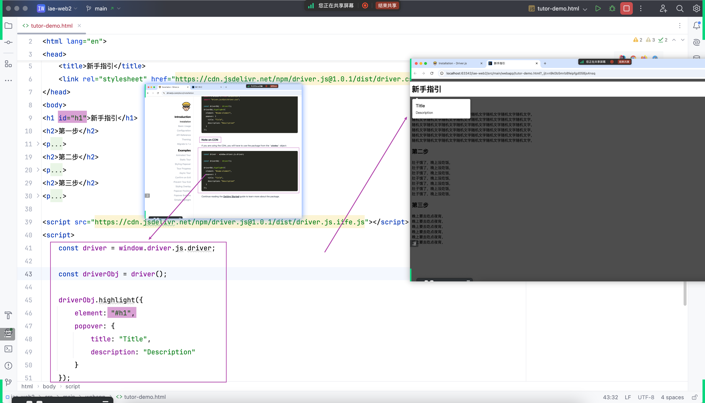

## 实现笔记中的“新手指引”功能
### 使用开源代码库：Driver.js
- 
- https://driverjs.com/

### 参考官方文档一步步实现功能
#### 锻炼阅读一手资源的能力

#### 重要步骤的截图
- 快速开始
- 
- 结合自己的页面内容
- 
- Proper 的方向配置
- 
- 退出前确认
- 
- 新手指引结束之后的事件监听
- 

## “新手指引”完成之后，下次不再弹出（一定时间内）
### 从 static 到 dynamic
- 
- 
### 复习客户端会话跟踪 - cookie
- 通过`添加cookie`和`查找cookie`，动态识别是否看过 “新手导航”
- 
- 

## 常见问题快速解答
- 

