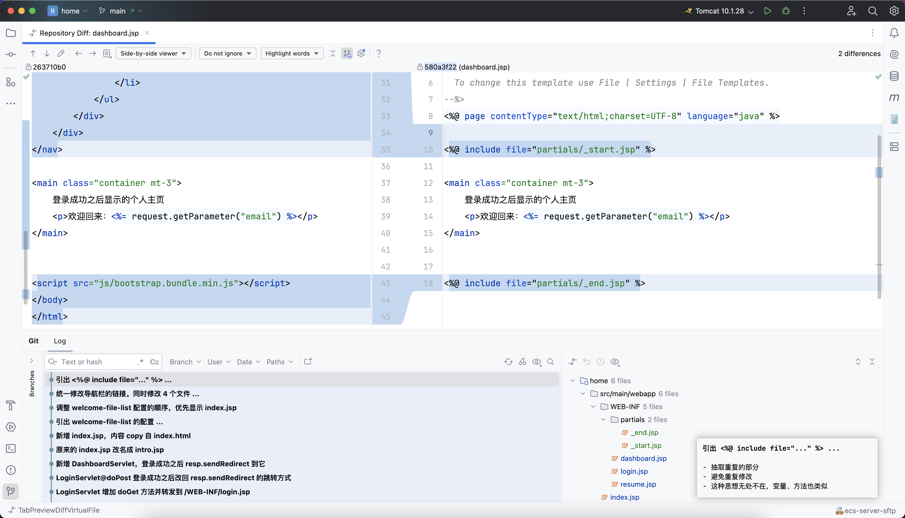
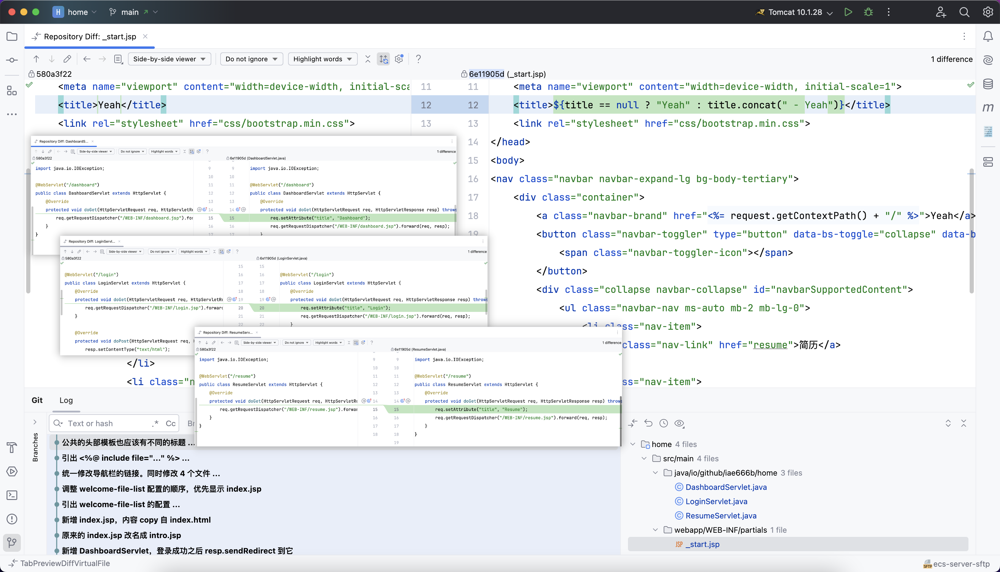
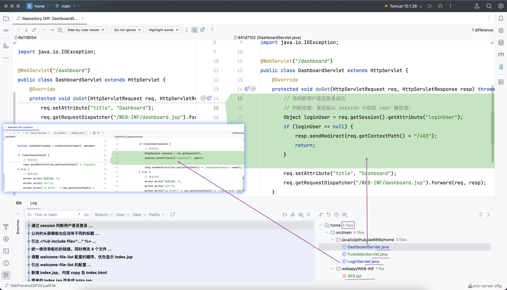
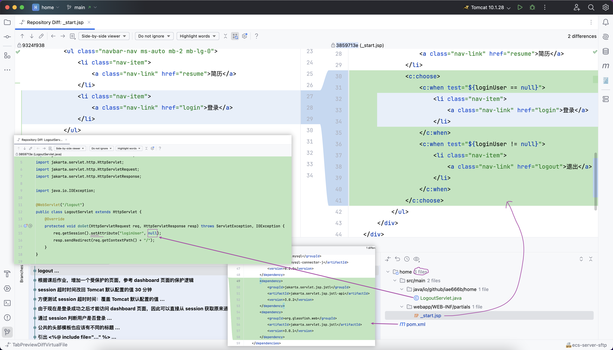
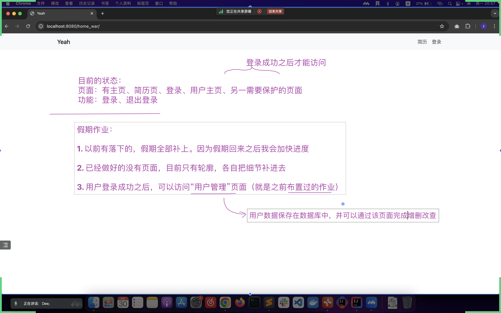

## 引出 <%@ include file="..." %> ...
- 抽取重复的部分
- 避免重复修改
- 这种思想无处不在，变量、方法也类似
- 

## 公共的头部模板也应该有不同的标题 ...
- _start.jsp 不同页面显示不同标题，由各自的 Servlet 提供具体的内容
- 

## 通过 session 判断用户是否登录 ...
- 如果未登录，而访问 dashboard 页面，直接跳到 ForbiddenServlet
- 

## 由于现在是登录成功之后才能访问 dashboard 页面，因此可以直接从 session 获取原来通过问号传递参数的内容 ...
session 中的 loginUser 属性正好保存的是 dashboard 页面要用到的 email

## logout...
- 记得 pom.xml 增加依赖
- 介绍新的 jstl 语法：choose-when
- 

## 课后作业
- 

