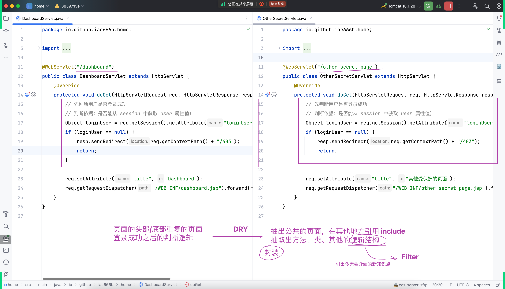
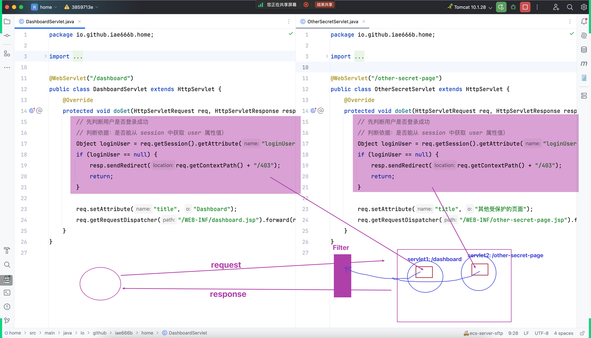
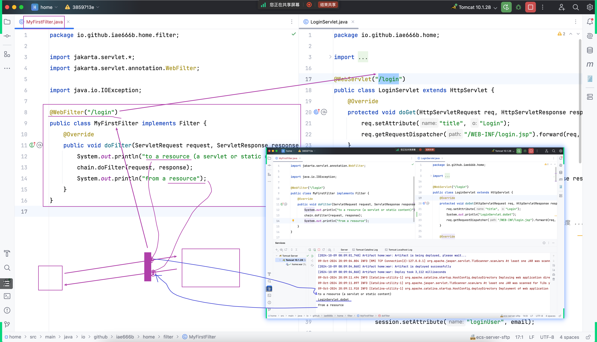
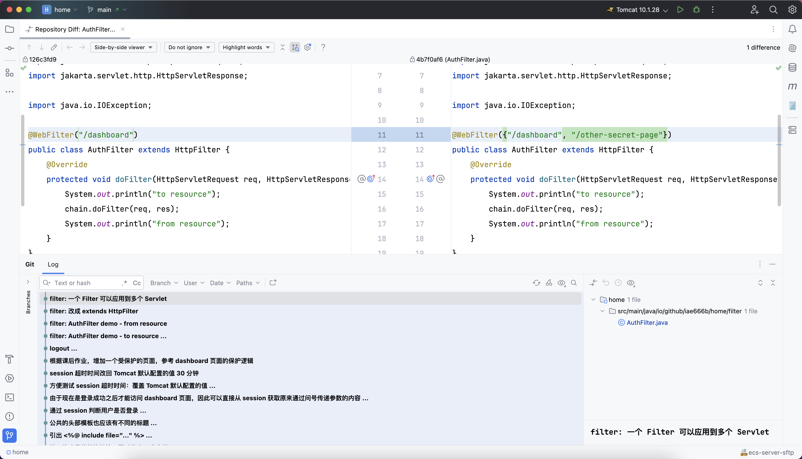
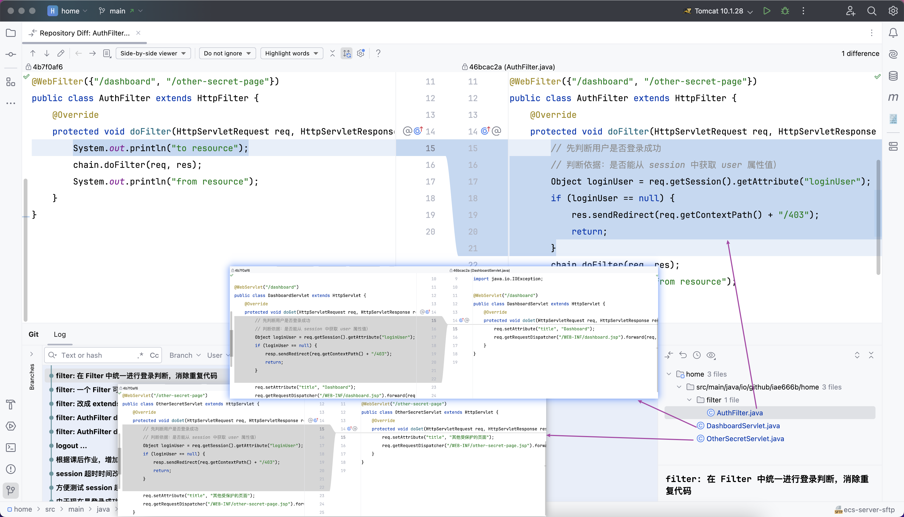
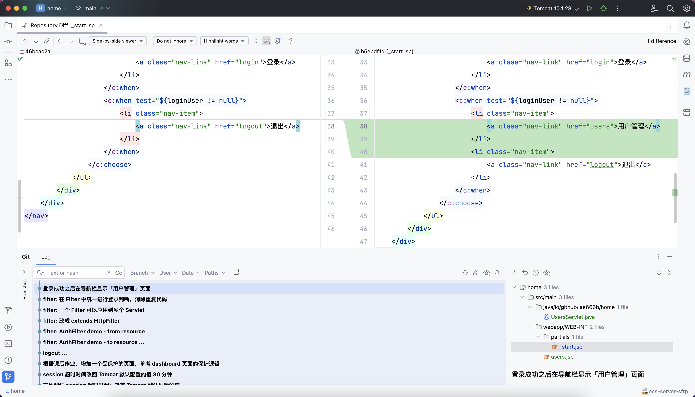
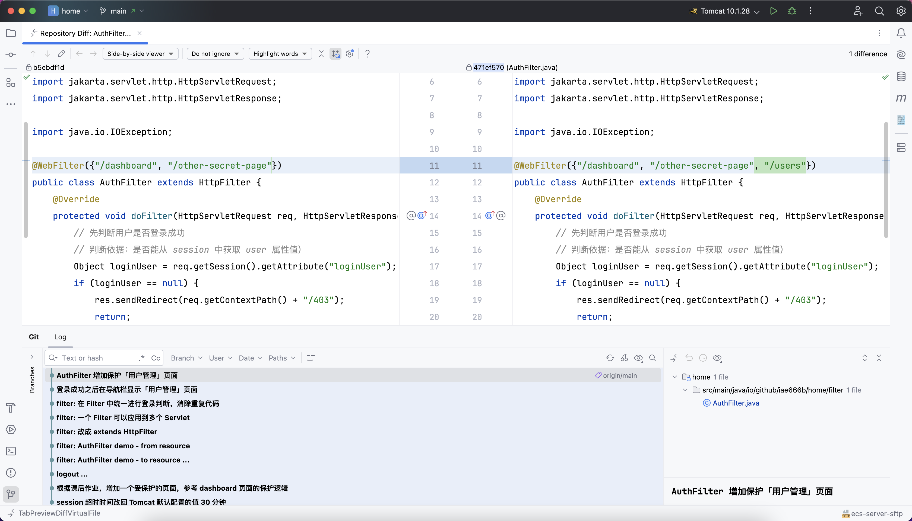
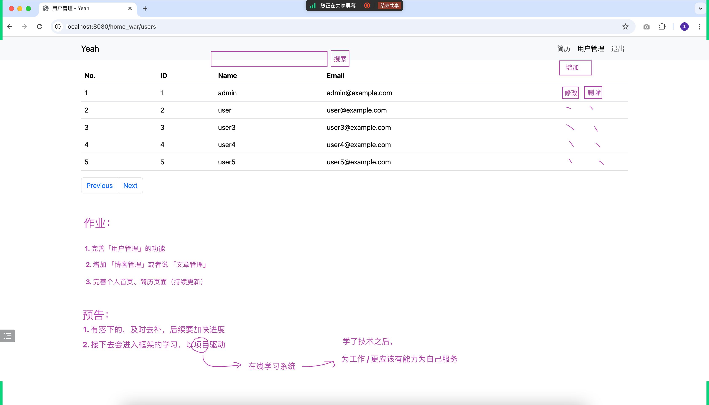

## 快速复习、类比生活并引出今天的新知识点:Filter
- 
- 

## 第一个 Filter 例子
- 

## filter: 一个 Filter 可以应用到多个 Servlet
- 

## filter: 在 Filter 中统一进行登录判断，消除重复代码
- 
- 登录成功之后在导航栏显示「用户管理」页面
- 
- AuthFilter 增加保护「用户管理」页面
- 

## 课后作业
- 

