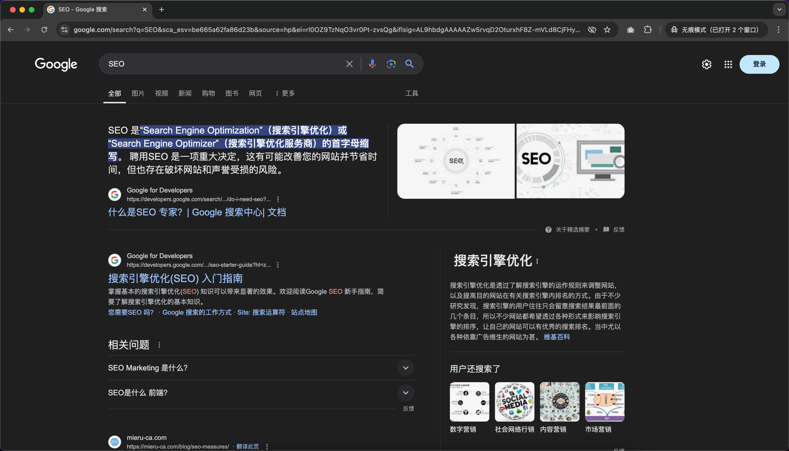

可以总结成两个核心内容：`网页元数据`和`「用户管理」课后作业解答`

## 网页元数据
通过在页面中提供额外的元信息，方便在**搜索引擎**或者**社交软件**中展示

### `网页元数据`在传统「搜索引擎」中的应用
如谷歌、百度等爬虫，在采集你网站的时候，大概率会读取 description、keywords 等元数据，用于搜索结果的展示
- 

扩展知识：SEO 搜索引擎优化
- 

### `网页元数据`在「社交软件」中的应用
如微博、微信、Facebook、Twitter等，大概率会支持 The Open Graph protocol 协议，读取 og:title、og:description、og:image 等元数据
- 

扩展知识：The Open Graph protocol
- https://ogp.me/
- 

## 「用户管理」课后作业解答
不管是增/删/改/查/获取其他功能，核心实现逻辑都类似：

### Client 端
- 用户输入了什么数据
  - 通过什么样的界面展示
  - 也可以用需要界面
- 数据提交到 Server 端的具体哪个 URL
- ...

### Server 端
- 接收用户输入的数据 (request)
- 验证用户输入的数据
- 处理用户输入的数据
  - 直接打印输出
  - 保存到文件/数据库/...
- 响应什么数据 (response)

### 回顾两张配图
- 当时讲 Servlet 画过的一张图
  - 
- 当时讲 Filter 画过的一张图
  - 
