## 关于阿里云服务器 ECS 试用到期
### 释放服务器（建议操作）
- https://help.aliyun.com/zh/ecs/ecs-free-trial
- 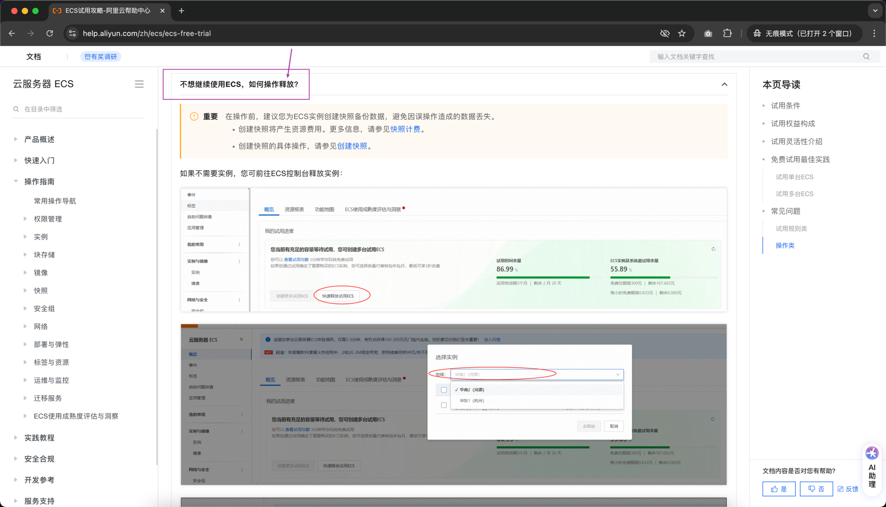

## 讲解完整的「用户管理」功能
### 重点强调
- 务必自己敲代码实现「用户管理」所有功能
- “用户”的增删改查学会了之后，“博客”、“商品”...等等其他类型系统的底层实现逻辑都类似
- 只不过后续会用更方便的框架来解决，但是：框架的本质也是对这些底层功能的封装而已
- 再实现「用户管理」的增删改查功能过程中，遇到以前学过，但是忘记的知识点，要及时去复习，看之前的笔记或代码
- ...

### 功能点图示
- 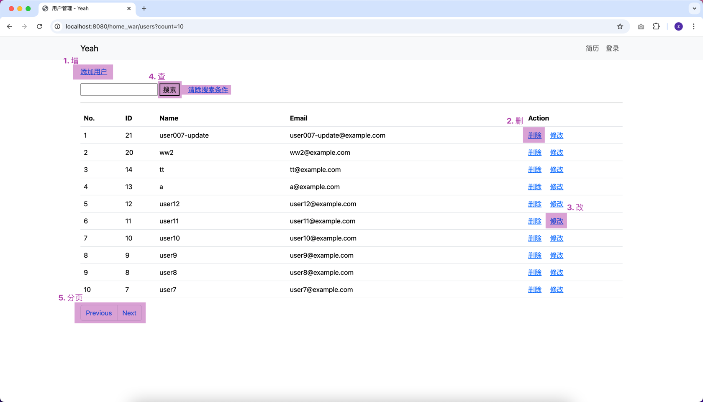

### 部分功能的图文解释
#### 增加用户
- 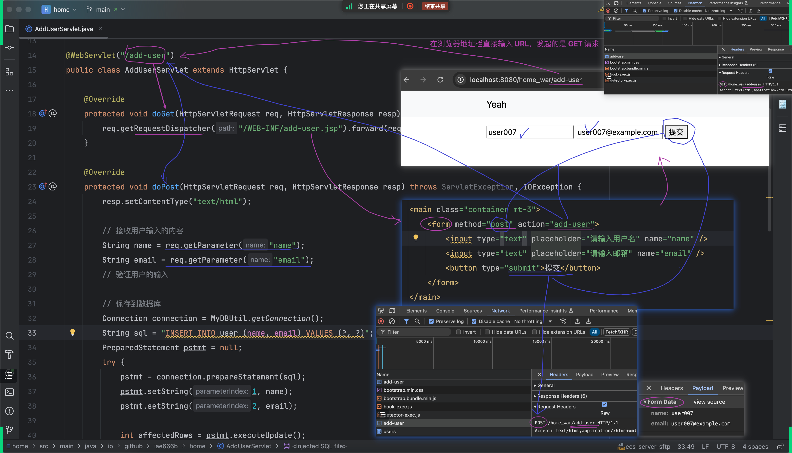
#### 删除用户
- 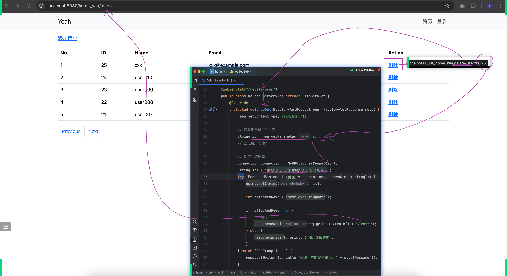
#### 修改用户
- 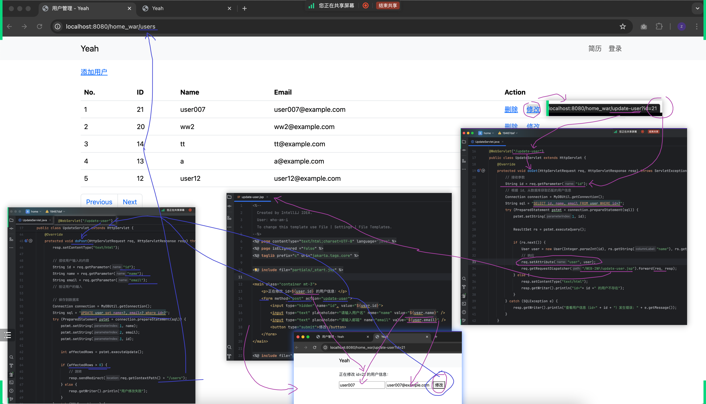
#### 查询用户
  - 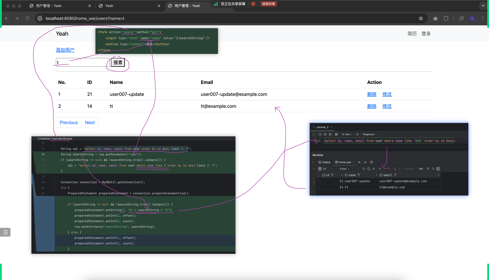

## 新知识：Listener
- 监听器（Listener）：Java Web 三大技术组件之一
- 之前已经学过了另外两个：Servlet 和 Filter
### 本节案例：ServletContextListener
监听整个应用的生命周期（启动、销毁）并根据自己的业务逻辑，在特定的时机添加自己的逻辑
- 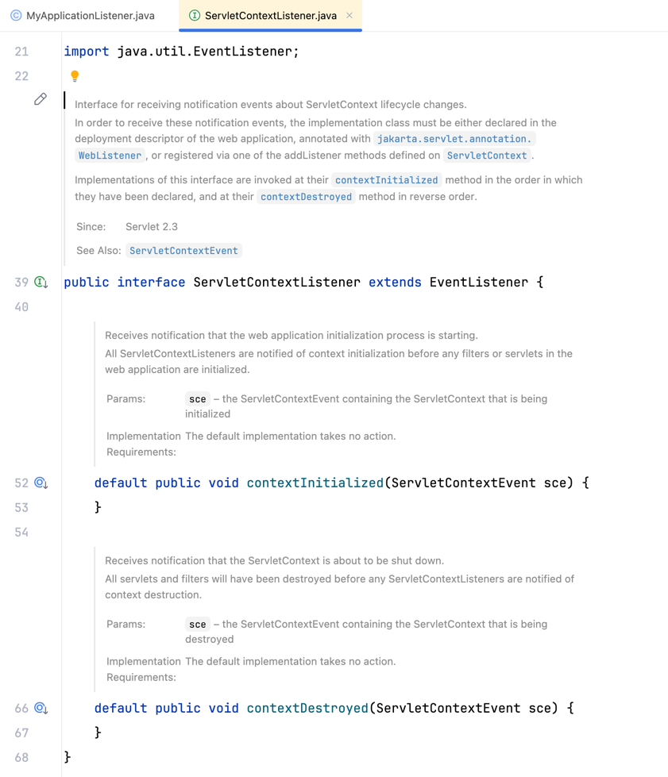
- 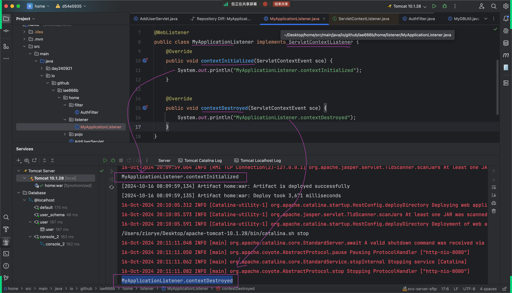
- 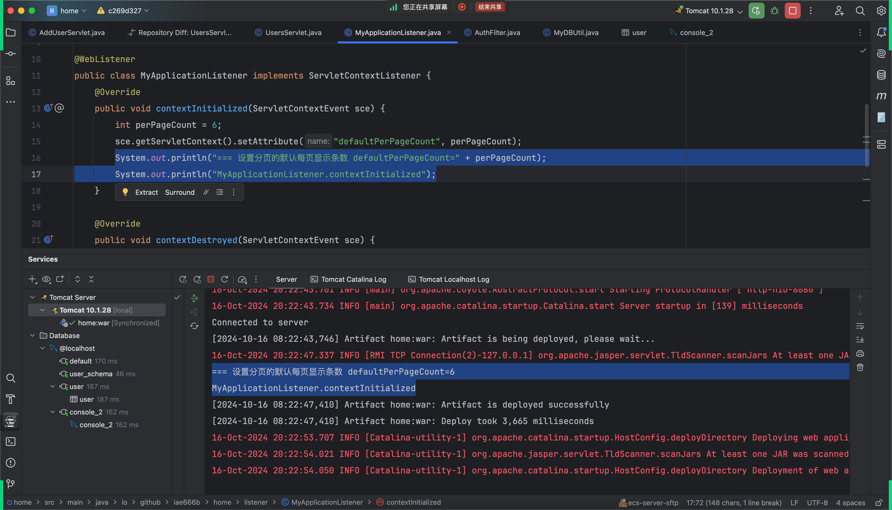
### 还有很多其他的 Listener
后续遇到的时候，再进一步讲解。比如：
- 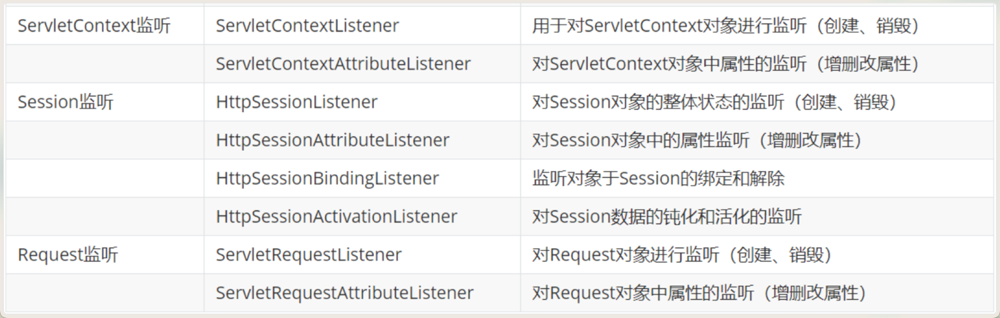

## 其他
- 以前讲 Servlet 划过的图
  - 
- 以前讲 Filter 画过的图
  - 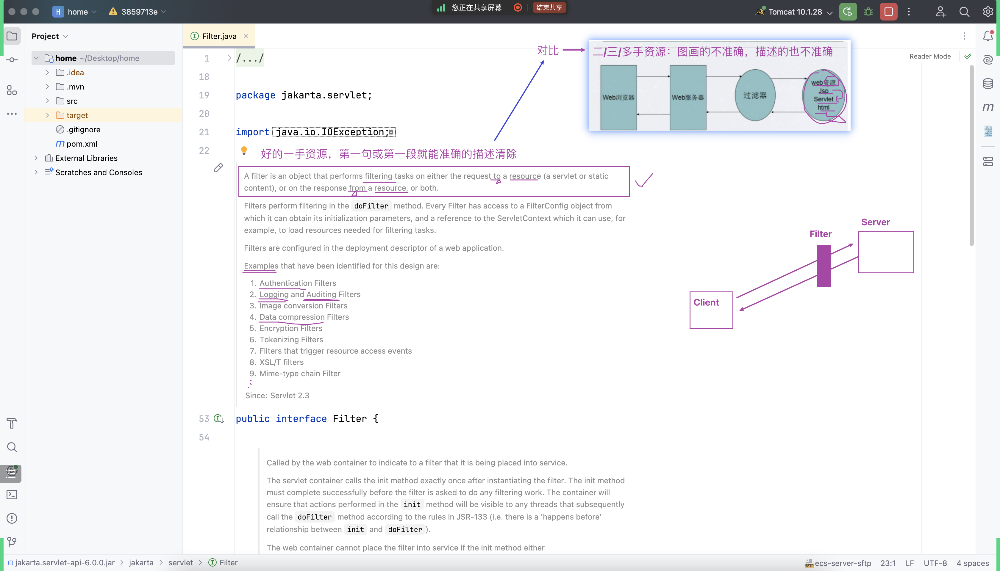
- 以前的知识：JDBC
  - https://gitee.com/iae23a12/iae-se-maven/tree/main/src/main/java/day240812/note
- 以前的知识：MySQL
  - https://gitee.com/iae23a12/iae-se-maven/tree/main/src/main/java/day240809/note#mysql
- 以前的知识：try-with-resources
  - 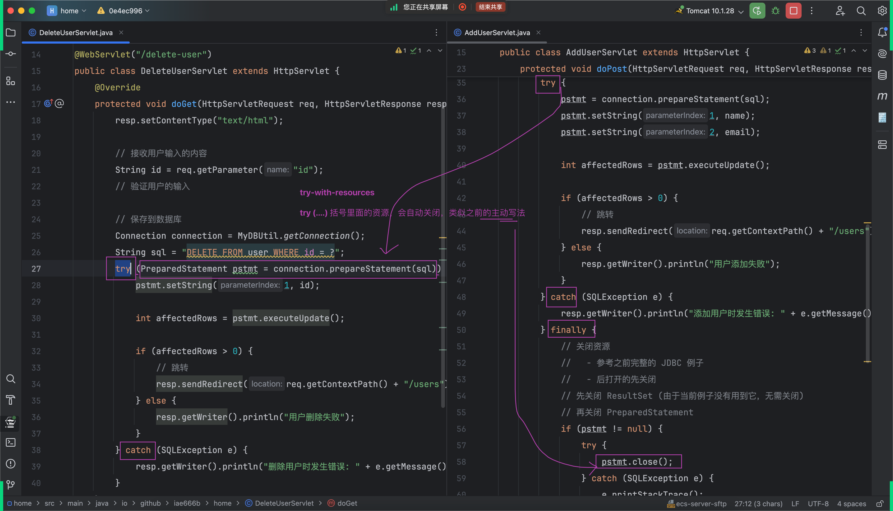

