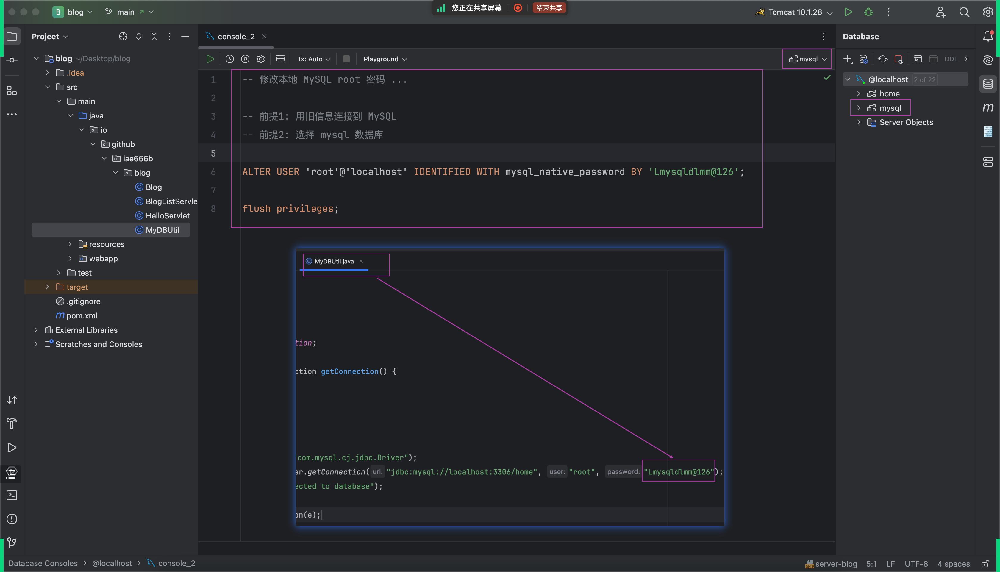

## 解决上节课的问题
### 问题描述
本地代码 Deploy 到远程服务器时，出现 404 无法服务的情况。
- 

### 本质原因
- 共享给大家用的那台远程服务器上安装的 JDK 版本是 17
- 有问题的几位同学本地安装的 JDK 大于 17，不兼容了

### 解决方法
- 
- 

## 修改本地 MySQL 数据库 root 密码
### 目的
让你的代码在本地运行和 Deploy 到远程都能顺利运行，无需修改源代码
### 操作步骤
- 
- 如上截图👆登录本地 MySQL 之后，进入名称为 `mysql` 的数据库，然后执行👇下面的语句
- 语句1：ALTER USER 'root'@'localhost' IDENTIFIED WITH mysql_native_password BY '修改这里：输入新密码（看视频或会议历史消息）';
- 语句2：flush privileges
- 如果弹出👇下面的提示框，点击 `Change Credentials` 输入新的密码
  - 
- 然后修改 `MyDbUtil.java` 代码的相应配置
  - 

## 除了 request.getContextPath() ...
除了 request.getContextPath()，还可以从 request 获取其他几个跟 URL 相关的信息；

总之，要获取客户端主动提供的或隐性提供的信息，找 request 

要响应信息给客户端，找 response 

提醒：回顾之前画过的 Java Web 三大技术组件的截图
- 

## 开源的后台管理界面模板

### AdminLTE
这类模板有很多，感兴趣的可以自己去找。
今天课上介绍的是：AdminLTE 3
- https://adminlte.io/
- 

### 今天的重要思路：`做减法`
- AdminLTE 下载回来之后有几十上百个页面
- 先大概点击，过一遍它能提供什么样的功能
- 然后，找到一个最最简单的页面

### 重点：如何把它引入我们的项目中
- 只需把上一步找到、单独的这一个 html 引入自己的项目即可
- 然后看这个 html 依赖了哪些资源，只把最必要的资源引进来

### 后续...
- 随着项目慢慢变大，后续可以去完整的代码中找对应的页面，按同样的思路精准引入
- 不多不少，刚刚好
