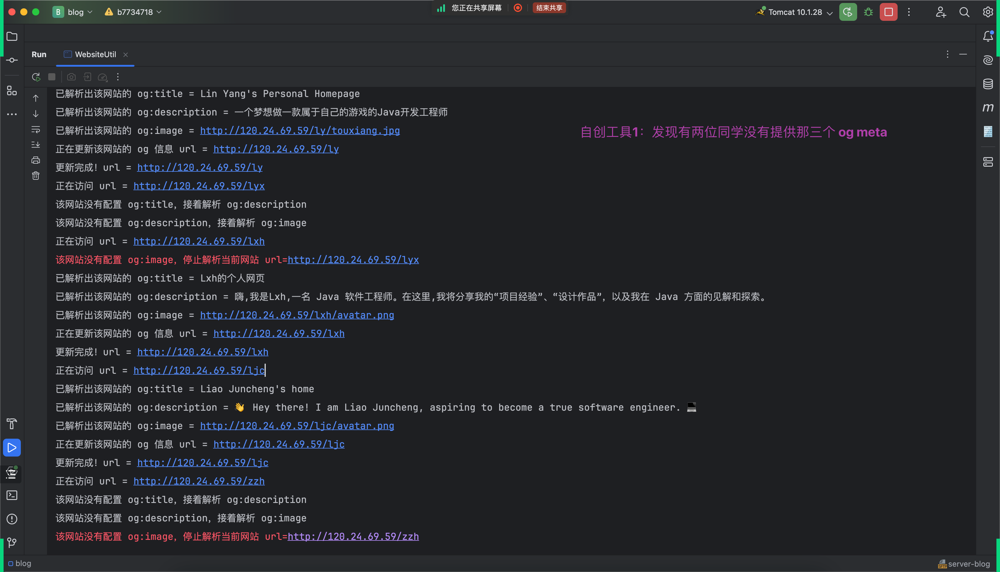
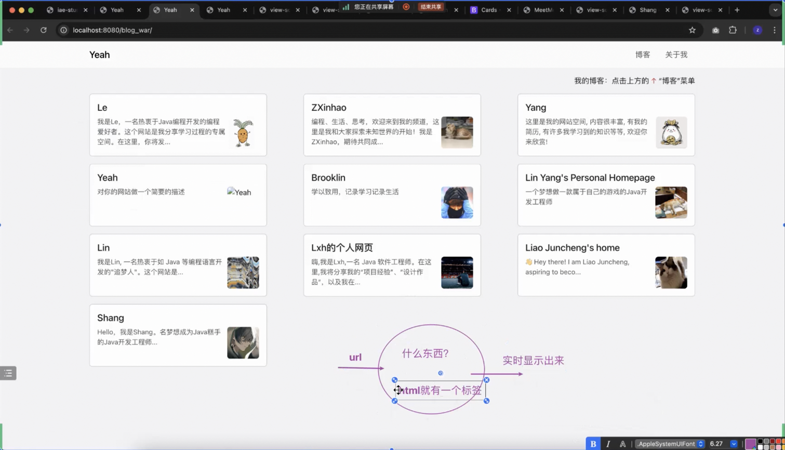
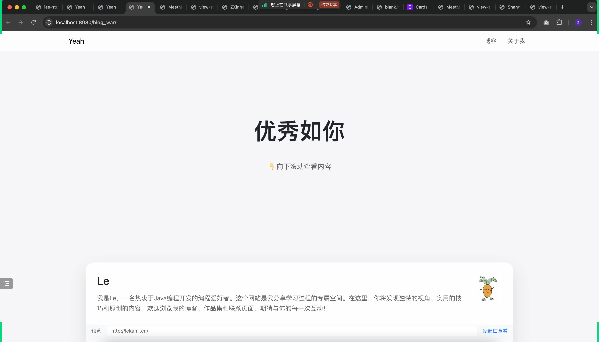
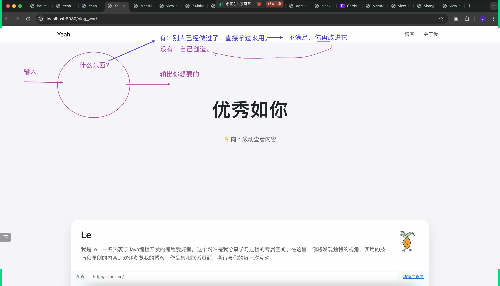
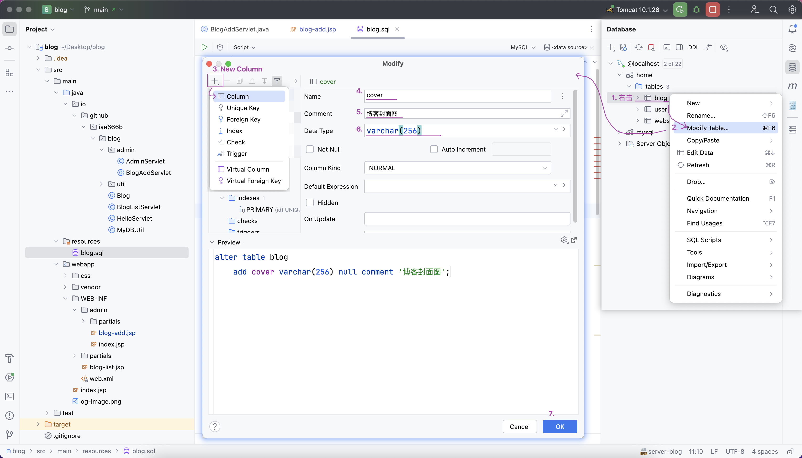
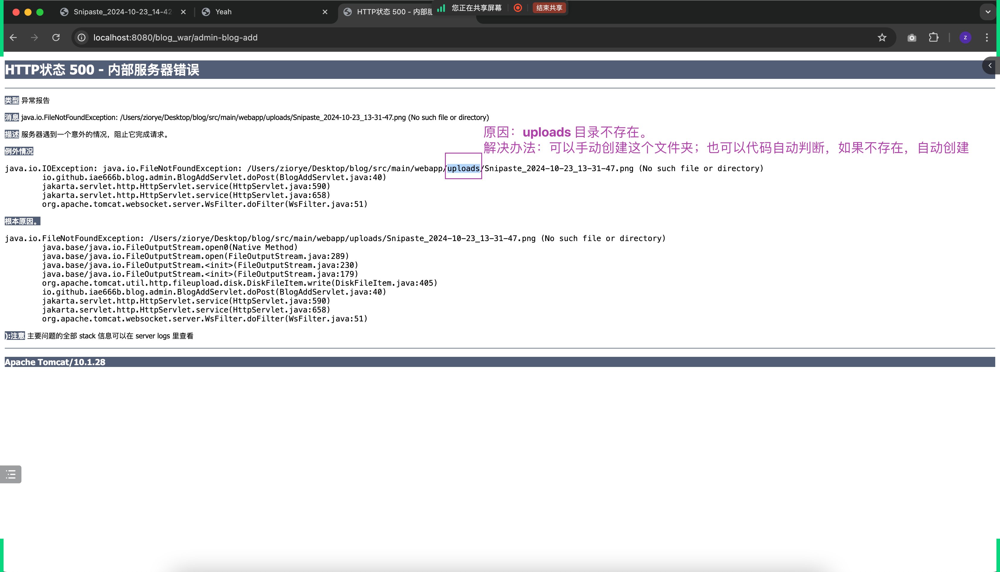
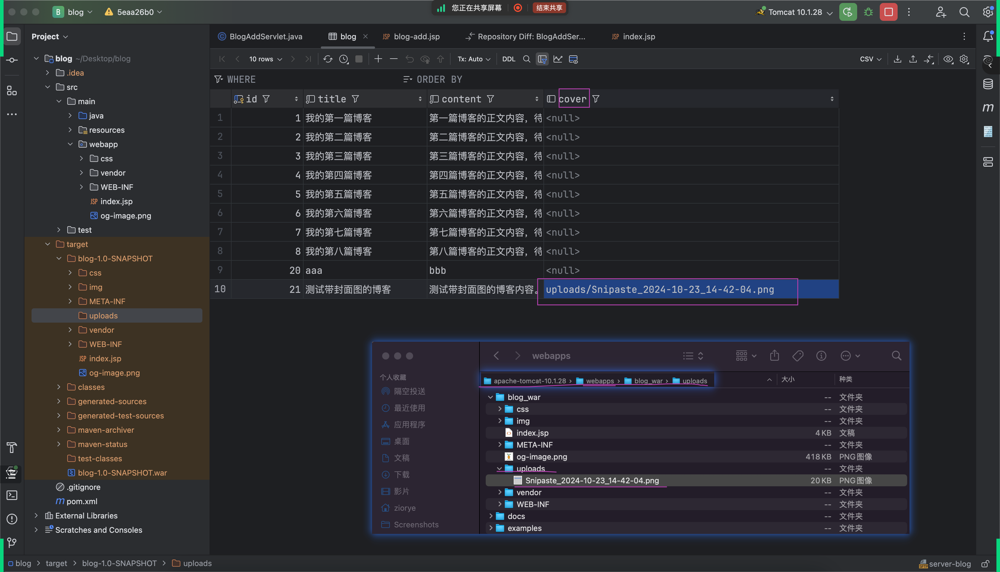
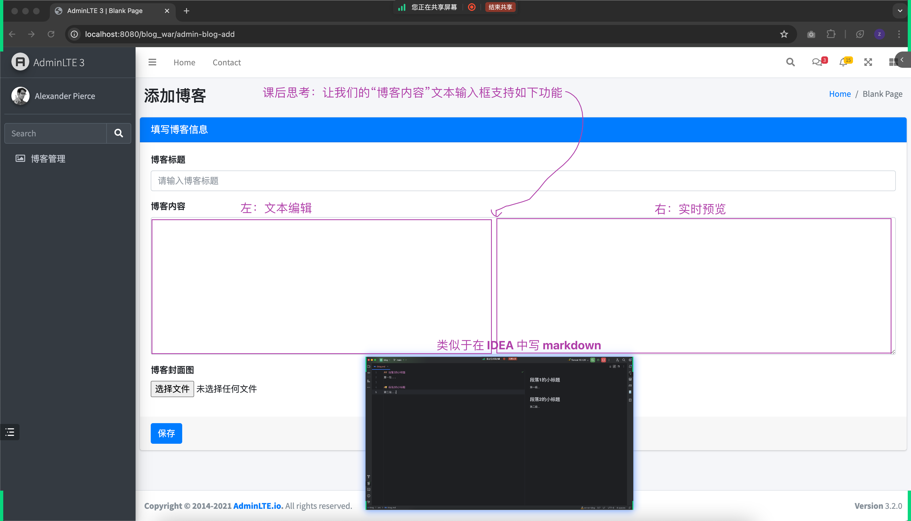

## 案例：技术为自己服务的小例子
### 需求
- 客户：我自己
- 具体需求：自动化检查学生作业完成情况，比如：
  - 每个人的首页是否都增加了 og:title, og:description, og:image
  - 同时需要及时了解具体的页面是否都自定义过

### 思考该如何实现（非常重要）
- 每个人都要思考、并点名回答
- 目的：不是求标准答案，也没有标准答案
- 是想锻炼大家的思路能力

### 我的几个迭代过程
- L1：自动解析 og:title, og:description, og:image
  - 
- L2：可视化展示 og:title, og:description, og:image
  - 
- L3：进一步可视化展示出 `整个` 网页的实时效果
  - 
- Ln：根据具体需求，可以持续迭代

### 重要的思路
- 

## 上传博客封面图
### 几处重要更新
- 表结构更新
  - 

### 报错及解答
- 

## 另一个重要思考：封面图保存在哪里？
- 

## 课后作业
- 
