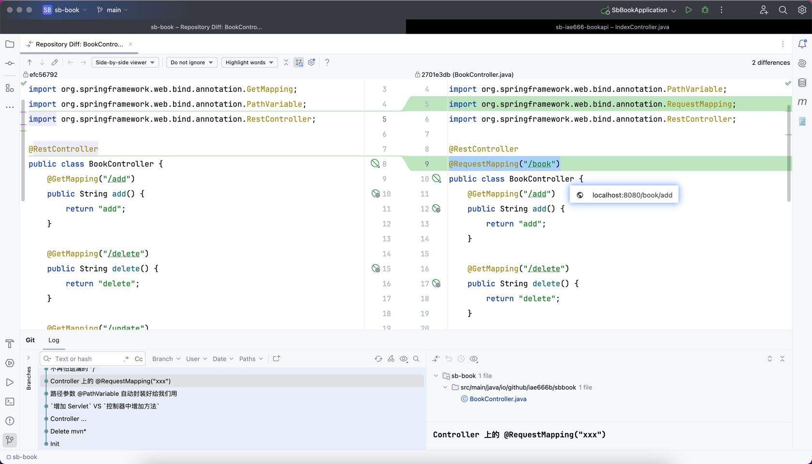
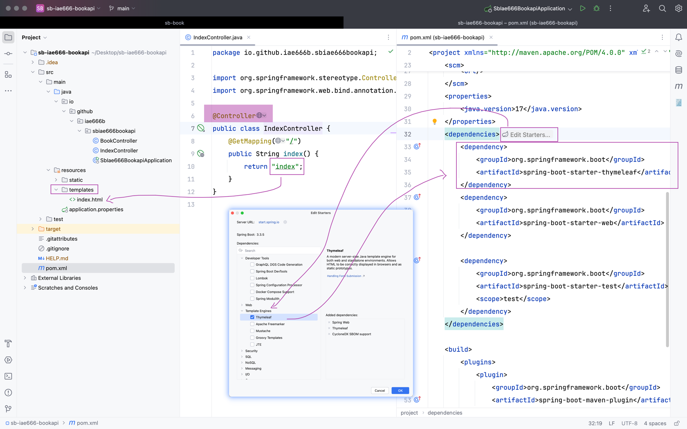

## 细看文件上传的请求数据
### 请求数据的差异
- 没有配置 enctype="multipart/form-data" 时
- 
- 配置了 enctype="multipart/form-data" 之后
  - multipart 的含义如下图所示，multi part
  - 
## 自己做一个最最简单的 `ISBN` 接口给别人用
`产品思维` VS `技术思维`
很多时候，看似简单的技术，就可以实现很有意思的小产品
## 继续学习 SpringBoot
### 快速复习如何创建 SpringBoot 项目

### 快速复习基础功能
- @RestController + @GetMapping("xxx")
- 
- 路径参数 @PathVariable 自动封装好给我们用
- 
### 问号参数 @PathVariable 同样自动封装好给我们用
- 
- @PathVariable 标记的参数默认是必须传递，也可以修改它
  - 
  - 这样配置之后，可以不传递这个参数了
### 在 Controller 类级别上增加路径前缀
- @RequestMapping("/book")
- 
### 不再怕遗漏的 "/"
- 以前写原始的 Servlet，如果 @WebServlet("/xxx") 忘记带上 /，会报错
- 现在，借助 SpringBoot 的便捷，可以大大方方删除 "/" 了，SpringBoot 会自动帮我们拼接它
- 
### 创建项目之后的快速添加依赖方式
- 如果后续需要增加勾选这些依赖，可以打开 pom.xml 方便的操作
- 
- @Controller + 模版页面
- 
### 快速修改内嵌服务端口号
- 