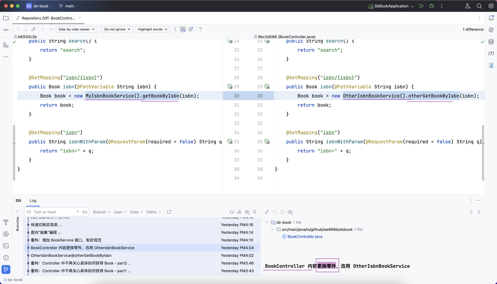

## 结合面向 “抽象”编程
### 重构：Controller 中不再关心具体如何获得 Book
- 黑盒子思想
- 先确定输入，输出
- 
- 填充黑盒子
- 
### OtherIsbnBookService - 新增一个 ISBN 查询服务类
- 不同的类名、不同的方法名 otherGetBookByIsbn
- 
- BookController 内容更换零件，改用 OtherIsbnBookService
- 
### 重构：增加 BookService 接口，制定规范
- 
### 面向“抽象”编程
- 不需要自己 new 了
- 增加注解（标记）@Service、@Autowired
- 
#### 快速切换实现类
- 而且 BookController 类不需要任何修改
- 
## 增加两个依赖，为入库做准备:
- MySQL Driver
- Spring Data JPA
- 
### 增加数据库相关配置
- createDatabaseIfNotExist=true
- 
### 增加 JPA 相关配置
- @Entity
- spring.jpa.show-sql=true
- spring.jpa.hibernate.ddl-auto=update
- 
  - spring.jpa.hibernate.ddl-auto=create (危险操作，方便本地测试，但是在真实环境一定一定不能用)
### extends JpaRepository
- 目前多次插入会报错，因为 isbn 设置成唯一
- 
- 
